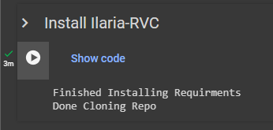
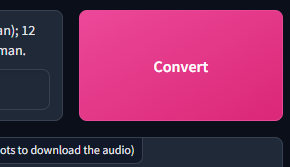

*`Written by Julia`*     
``Last update: Jan 27, 2024``
‎ 
***  
###### ‎ 
:::content-center
## Introduction 📜
:::
- Ilaria RVC is a port of EasyGUI ([<u>Mangio</u>](https://aihubdocs.github.io/en/rvc/local/mangio-rvc/)) to [<u>Google Colab</u>](https://aihubdocs.github.io/en/other/glossary/#google-colab), made by Ilaria.     

- Works for inferencing only, has a pretty UI, amazing speed, & the great tools that Mangio has (such as [<u>Mangio-Crepe</u>](https://aihubdocs.github.io/en/rvc-resources/inference-settings/#pitch-extraction-algorithm) algorithm).

- It's liked for being the fastest, free & of unlimited use way of inferencing via the cloud.       
‎               
### Pros & Cons :icon-tasklist:
==- ***Tap to unfold 👈***
!!! *The pros & cons are subjective to the level of experience and needs of the user.*
You might disagree with some of the points made.
!!!
||| **PROS** ✔️ 
:icon-plus: Model download through links.    
:icon-plus: Two extra TTS tools.     
:icon-plus: UI is user-friendly for everyone.        
:icon-plus: Mangio-Crepe algorithm.      
:icon-plus: Takes a short time to set up.  
:icon-plus: Very quick.  
|||  **CONS** ❌  
:icon-plus: Usage limit of 6 hours per day.     
:icon-plus: Takes a bit of time to set up.
|||
===

***
###### ‎ 
:::content-center
## How to Use 📝
:::
!!! NOTES:
• ‎ Ensure you have a stable Internet connection before proceeding.   
• ‎ If you encounter an issue during the tutorial, read the [<u>Troubleshooting</u>](https://aihubdocs.github.io/en/rvc/cloud/inference/ilaria-rvc/#troubleshooting-) chapter below.
!!!

###### ‎ 
#### 1. <u>Enter the space.</u>
a. If you haven't already, first log in to your [<u>Google account</u>](https://accounts.google.com/). 

b. Then access the [<u>Colab space</u>](https://colab.research.google.com/drive/16LkwvFZeudTpUOsE_6bMjOq2qkxFo8Hr?usp=sharing).
***
###### ‎ 
#### 2. <u>Set up space.</u>
Execute the `Install Ilaria-RVC` cell, by pressing the play button, then `Run anyway`.       
Ilaria RVC will begin to set up.    
      
‎ ‎ ‚Äé‚Äé               
(If red text appears showing errors, ignore it, it's normal)

‎   
It'll finish when the cell says `Done Cloning Repo`.

***
###### ‎ 
#### 3. <u>Open Gradio.</u> 
Now execute the `Start` cell below.        
After a bit it's going to show you two links. Open the **public URL** one, in a separate window.        

The **Gradio** link contains the Ilaria RVC app.

       

‎       
!!!warning Do not close the <u>Colab</u> tab until you are done.      
If you do, you'll have to do this procedure again. Ilaria RVC needs it running in order to work.
!!!
***
###### ‎ 
#### 4. <u>Download voice model.</u>
a. After loading, close the bottom window & go to the ``Download Voice Models`` tab.     

b. Paste the link of the model in the `Hugging Face Link` bar.      
It must be a public link from either [**<u>Hugging Face</u>**](https://aihubdocs.github.io/en/other/glossary/#hugging-face) or **Google Drive**.

c. In `Name of the model`, insert a name for it then click `Download`.        

    

!!!warning Don't name it with spaces/special characters, to avoid errors.
Example: **"ariana_grande_2023"** and not **"ariana grande 2023 >.<!"**.    
!!!
***
###### ‎ 
#### 5. <u>Select model.</u>  
a. Return to the `Inference` tab & click the upper pink `Refresh` button.
b. Click the `Choose the model` dropdown  & select your model.

    
***
###### ‎ 
#### 6. <u>Select your audio.</u>  
Below it, in `Drag your audio file and click refresh`, click it to load your audio manually. Or just drag the file into it.         

 

***
###### ‎ 
#### 7. <u>Adjust settings.</u> (optional)    
If you wish, you can modify the [<u>inference settings</u>](https://aihubdocs.github.io/en/rvc-resources/inference-settings/) in `Index Settings` & `Advanced Options` for better results.   
Tap them to unfold them.      

 ‎                  
‎
***
###### ‎ 
#### 8. <u>Convert.</u>     
Click the upper `Convert` button and wait.

   

***
###### ‎ 
#### 9. <u>Download output.</u>        
Once it's done processing, a playable audio of the output will pop up.      
Or tap the three buttons on the right of the audio and then `Download`.         

‎     
‎       

#### *:icon-heart-fill: If you liked the app, please consider supporting Ilaria: [<u>https://ko-fi.com/ilariaowo</u>](https://ko-fi.com/ilariaowo) :icon-heart-fill:*  
::: 
***
###### ‎
:::content-center
## Troubleshooting 🛠️
:::
> ***I get a red popup saying `Error`.***   
- Don't worry, it's normal. Try repeating your action.

- If the error persists, reload the Gradio page. Click `Refresh` & ensure your audio is selected in the `Choose the audio file` dropdown. 

- If it's still persisting, restart the Colab space.        
For this, go to the Colab space. At the top click `Runtime`, then `Disconnect and delete all data`, & reload the page.
***
> ***My model doesn't have a link from HF/GD.***
- Upload a **.ZIP** file of the model to Hugging Face as a **public** repo.
- If you need help, click [<u>here</u>](https://aihubdocs.github.io/en/essentials/how-to-upload-models-to-hugging-face/).
***
> ***I can't download my model.***      
- This could be due to a few reasons:     

    1. **<u>Link is private</u>:** 
        - **If you uploaded to GD:** ensure the `General access` is set as `Anyone with the link`.
        - **If you uploaded to HF:** ensure the repo is set as `Public`. Learn more [<u>here</u>](https://aihubdocs.github.io/en/essentials/how-to-upload-models-to-hugging-face/).            
        ‎   
    2. **<u>Invalid HF link:</u>**
        - The HF link must contain the word "**.zip**".
        - If the link contains the word `blob`, replace it for `resolve` and paste it.     
    ‎       
    3. **<u>Incorrect files:</u>**
        - The model must be zipped in a **.ZIP** file. Not .RAR or .7ZIP.
        - Ensure it contains the [<u>correct files</u>](https://aihubdocs.github.io/en/essentials/how-to-upload-models-to-hugging-face/).

***
> ***The voice glitches out. How do I fix it?***
- This is an anomaly called "**artifacting**".           
Learn more & fix [<u>here</u>](https://aihubdocs.github.io/en/rvc-resources/artifacting--how-to-fix-it/).
***
> ***I couldn't find my answer, what now?***
- Need help? Join AI Hub [<u>here</u>](https://discord.com/invite/aihub). Ask in the `#help-chat` or `help-forum` channels.
***
:::content-right
||| *Did I miss anything?*        
Send any feedback [<u>here</u>](https://forms.gle/5i6hTJRVkXRohvVF9) 👈
|||
:::
