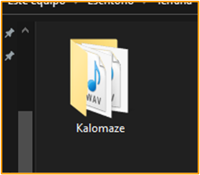
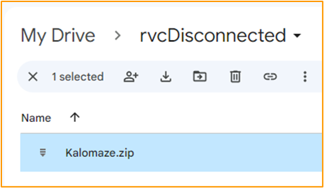

*``Originally written by Angetyde``*        
*``Re-done by Julia, Eddy, Poopmaster & Light``*       
``Last update: Jan 27, 2024``
***
###### ‎
:::content-center
## Introduction 📜
:::
###### ‎              
- RVC Disconnected a port of RVC to [<u>Google Colab</u>](https://aihubdocs.github.io/en/other/glossary/#google-colab), for exclusively training.       
Notebook made by [<u>Kit Lemonfoot</u>](https://huggingface.co/Kit-Lemonfoot).

- It's free, includes all the necesary tools for a quality model, the [<u>Tensorboard</u>](https://aihubdocs.github.io/en/rvc-resources/epochs-overtraining--tensorboard/#what-is-tensorboard), & it's the fastest Colab space for training.    

- Making it the go-to method for training for cloud RVC users. Pretty much the only big downside is the time limit (but you can switch to another account & continue).      
‎       
### Pros & Cons :icon-tasklist:

==- ***Tap to unfold 👈***
!!! *The pros & cons are subjective to the level of experience and needs of the user.*
You might disagree with some of the points made.
!!!
||| **PROS** ✔️   
{.list-icon}  
- :icon-plus: Contains TensorBoard.    
- :icon-plus: Has Mangio-Crepe.     
- :icon-plus: Option to save model to HF.  
- :icon-plus: Includes the latest *pretrains*.
    Speeds up the process.
|||  **CONS** ❌ 
{.list-icon}        
:icon-dash: UI not user-friendly.   
:icon-dash: Takes a moment to load.      
:icon-dash: Can't train long datasets due to time limit, you'll have to switch accounts.        
:icon-dash: For free users is slower compared to local RVC.  
:icon-dash: You can't leave training unsupervised, as it can disconnect.
|||
===
***
###### ‎ 
:::content-center
## How to Train 💾
:::
###### ‎ 
!!! <u>Important notes:</u>
• ‎ This guide is centered around the [<u>TensorBoard</u>](https://aihubdocs.github.io/en/rvc-resources/epochs-overtraining--tensorboard/). Read it first if you haven't already.    
• ‎ Turn on [<u>third-party cookies</u>](https://cleeng.zendesk.com/hc/en-us/articles/360009526800-How-to-enable-third-party-cookies-on-my-browser-), or TB might not work.
!!!
###### ‎    
#### 1. <u>Prepare the dataset </u>        
a. Outside of Colab, make a folder named after your model, & place your dataset inside it. 

    Don't include spaces/special characters.     
Example: `ArianaGrande2023` and not ``Ariana Grande 2023 >.< !``.   

    ‎                     
‎       
b. Now [<u>zip</u>](https://support.microsoft.com/en-us/windows/zip-and-unzip-files-8d28fa72-f2f9-712f-67df-f80cf89fd4e5) the folder as a `.ZIP` folder.      

    Not as .7ZIP or .RAR, as they aren't compatible with RVC Disconnected.

    ‎           
‎       
!!! <u>Reminder:</u>
With modern versions of RVC, the dataset doesn't need to be split into various audios. One audio file is enough.
!!!
***
###### ‎ 
#### 2. <u>Set up the Colab space.</u>      
a. Head over to the [<u>Colab space</u>](https://colab.research.google.com/drive/1XIPCP9ken63S7M6b5ui1b36Cs17sP-NS#scrollTo=ZodNcumpg-JM).

a. Execute the ``Dependencies`` cell. This process will take a moment       

    ‎  
‎       
b. Click ``Connect to Google Drive``, select your Google account, & then ``Allow``.

    ‎       
‎       
c. Once it's done, in Google Drive go to the ``rvcDisconnected`` folder.        
Put the dataset's .ZIP inside said folder.

    ‎    

***
###### ‎ 
#### 3. <u>Set Training Variables.</u>      
a. Go to the `Set Training Variables` cell.      

    ‎   
‎   
b. Define `experiment_name` as your model's name.      
    Don't include spaces/special characters.

c. Set `pretrain_type` as `original` if you aren't familiar with it.

b. Select `target_sample_rate` as your dataset's [<u>sample rate</u>](https://aihubdocs.github.io/en/rvc-resources/audio-formats--sample-rate/#sample-rate).
    !!!
    • ‎ If it's **44.1k**, select ``40k``.      
    • ‎ If it's lower than **32k**, select ``32k``. 
    !!!
###### ‎ 
e. In ``pitch_extraction_algorithm`` select either ``RMVPE``, ``Crepe`` or ``Mangio-Crepe``, according to your needs.        
Don't use Harvest, as it's obsolete.           

    Learn more [<u>here</u>](https://aihubdocs.github.io/en/essentials/how-to-make-an-rvc-voice-model/).

***
###### ‎ 
#### 4. <u>Set the enviroment.</u>      
a. Go to `Load Dataset` cell.  

    ‎   
‎  

    In the `dataset` bar type the name of the dataset's .ZIP, followed by its file extention (.zip). Then execute the cell.    
Example: `kalomaze.zip`.

    
b. Below it, execute `Preprocessing`, ``Feature Extraction``, & ``Save preprocessed dataset files to Google Drive``.

    ‎   
***
###### ‎ 
#### 5. <u>Train Index.</u>   
a. Run ``Index Training`` to create the [<u>.INDEX</u>](https://aihubdocs.github.io/en/essentials/voice-models--how-to-search-them/) file.      

    ‎        
‎       
b. To download it, open `rvcDisconnected` in your GD storage. Open the folder named after the model, select the .INDEX file, click the three dots & `Download`.
 
    ‎  
***
###### ‎ 
#### 6. <u>Set Training.</u>       
a. Go to the `Training` cell.  

    ‎    
‎   
b. In `Save frequency` you determine at how many [<u>epochs</u>](https://aihubdocs.github.io/en/rvc-resources/epochs-overtraining--tensorboard/) the model will saved at.       
If you are a newbie, leave it at `15`.      

    - Think of it as how often RVC will make a "saving checkpoint" file of your model.     
    - They're useful to resume training starting from where you left. You'll learn more later.          
    - Example: with a value of ``10``, RVC will save the model at every 10 epochs (10, 20, 30, etc.)       
‎         
‎     
c. In `total_epochs` input the total amount of epochs (training cycles) used for the training.    

    Since we'll use a TensorBoard, using an arbitrarely large value like `2000` is probably enough, to avoid re-training. Learn more [<u>here</u>](https://aihubdocs.github.io/en/rvc-resources/epochs-overtraining--tensorboard/) if you haven't already.     
‎   
d. Leave `batch_size` as ``8`` if you are a newbie.     
If your dataset is short (around 2 minutes or less), use ``4`` instead.    
  
 
***
###### ‎ 
#### 7. <u>Begin training.</u>    
Now  begin training by running the `Training` cell.     
Be patient, it may take hours.

 TB will open up automatically. Remember to keep an eye on it.             
!!!warning <u>While training, you might get disconnected if you:</u>
• ‎ Ran out of usage time.       
• ‎ Don't interact with the space for a long time (staying AFK).     
• ‎ Get disconnected from your Internet.       
• ‎ Don't solve the captchas that (might) pop up ocasionally. 
!!!
***
###### ‎ 
#### 8. <u>Download model.</u>    
a. Once you detect overtraining, to stop training click the stop button of the ``Training`` cell.     

b. Click the folder symbol on the right, open the ``Mangio-RVC-Fork`` folder, then `weights`.        
You'll find a list of each [<u>.PTH</u>](https://aihubdocs.github.io/en/essentials/voice-models--how-to-search-them/#voice-model-files) file of every epoch cycle/training step, with this format: ``modelname_epochnumber_stepnumber.pth``.        

    Right-click the right training point & press `Download`. 

    ‎        

    And that's all. Have fun with your model.       
    
    Be sure to put the .PTH & .INDEX in a folder to keep it organized.
***
###### ‎ 
:::content-center
## How to Re-Train 🔄
:::
###### ‎  
If the model still needs training, you can resume the training from a previous checkpoint instead of starting from scratch.     
‎  
#### <u>INSTRUCTIONS:</u>

1. To do this, open the Colab space, input the exact same criteria as before & execute the cells like normal, **EXCEPT** ``Preprocessing`` & ``Feature Extraction``.    
‎       
2. Execute the `Load preprocessed dataset files` cell.   

    ‎  
‎       
3. Go to `Import Model from Drive to Notebook`. In `STEPCOUNT` introduce ``2333333`` & execute it.    

    ‎  
    ‎       
4. And now you can resume training. Run the `Training` cell, & rememeber to keep an eye on the [<u>TB</u>](https://aihubdocs.github.io/en/rvc-resources/epochs-overtraining--tensorboard/#what-is-tensorboard).
***
:::content-right
||| *Did I miss anything?*        
Send any feedback [<u>here</u>](https://forms.gle/5i6hTJRVkXRohvVF9) 👈
|||
