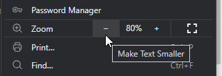

# Home
*`Written by Julia & Eddy`*        
``Last update: Jan 30, 2024``         
***
###### ‎     
:::content-center
## Introduction
:::
- This website is a **beginner-friendly documentation** of RVC & related apps, made by members of the [<u>AI Hub</u>](https://discord.com/invite/aihub) community.

- The goal is to facilitate its use & knowledge for the people & newcomers, through **simple & convenient guides**.

- Topics include: model training, inference, audio isolation, datasets, TensorBoard & more, either **locally** or through the **cloud**.

- **Feedback is welcomed!** Big or small we'll appreciate it. Send your ideas <u>[**here**](https://forms.gle/5i6hTJRVkXRohvVF9)</u> :icon-heart-fill:     
You're free to open an [<u>issue</u>](https://github.com/AIHubDocs/en/issues)/submit a [<u>pull request</u>](https://github.com/AIHubDocs/en/pulls) to our <u>[GitHub page](https://github.com/AIHubDocs/en)</u> as well.    
‎   
***
!!!success ‎  
:::content-center
## <u>Essentials</u>
#### - Most searched guides -      
‎   
***For a better experience*</u>, ensure your browser's [*zoom*](https://www.groovypost.com/howto/zoom-in-and-out-in-google-chrome/) level at 80% or 90%.**   
       
:::content-center   
‎          
:::
###### ‎
>#### :icon-chevron-right: [<u>How To Make AI Cover</u>](https://aihubdocs.github.io/en/essentials/how-to-make-ai-cover/) 🎶
>‎ ‎ ‎ • ‎ ***Basics for making AI covers with RVC, in any device.***
>***
>#### :icon-chevron-right: [<u>How To Make An RVC Voice Model</u>](https://aihubdocs.github.io/en/essentials/how-to-make-an-rvc-voice-model/) 💾
>‎ ‎ ‎ • ‎  ***Starting point for training RVC voice models, for all devices.***
>***
>#### :icon-chevron-right: [<u>How To Search An RVC Voice Model</u>](https://aihubdocs.github.io/en/essentials/voice-models--how-to-search-them/) 🔍
>‎ ‎ ‎ • ‎  ***What a voice model is & FOUR ways to search them.***
>***
>#### :icon-chevron-right: [<u>How To Upload Model To Hugging Face</u>](https://aihubdocs.github.io/en/essentials/how-to-upload-models-to-hugging-face/) 🤗
>‎ ‎ ‎ • ‎ ***Quick tutorial to upload & get a link from HF.***
>***
>#### :icon-chevron-right: [<u>How To Upload Model To AI Hub/Get Model Maker Role</u>](https://aihubdocs.github.io/en/essentials/how-to-get-model-maker-role-in-ai-hub/) 📤
>‎ ‎ ‎ • ‎ ***Procedure & rules for the model submission.***
!!!
***
###### ‎      
## Credits 🤝
#### Project lead by Julia & Eddy.      
<u>***A thanks to everyone who collaborated:***</u>
- Poopmaster
- Tetski
- Raid
- Light
- Faze Masta
- LollenApe
- Alexolotl
- SimplCup
- Litsa The Dancer
- Grvyscale
- Delik
- Mia
***